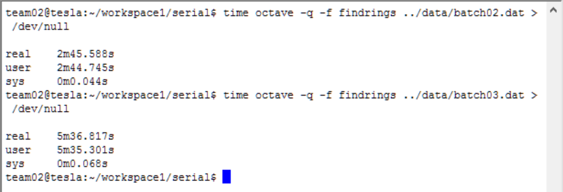

# Machine learning circle fitting in CUDA
Implementation of a variation of the k-means clustering algorithm that achieves circle fitting for points in the 2D plane, for a NVIDIA GPU
(parallel) architecture, using C and CUDA

- Achieved up to 800% speedup against the serial implementation, for a specific CPU/GPU setup.
- Extensively tested multiple software architectures to further improve GPU usability and general efficiency.

# Designed Architecture

# Sample Executions 

# Output Images

