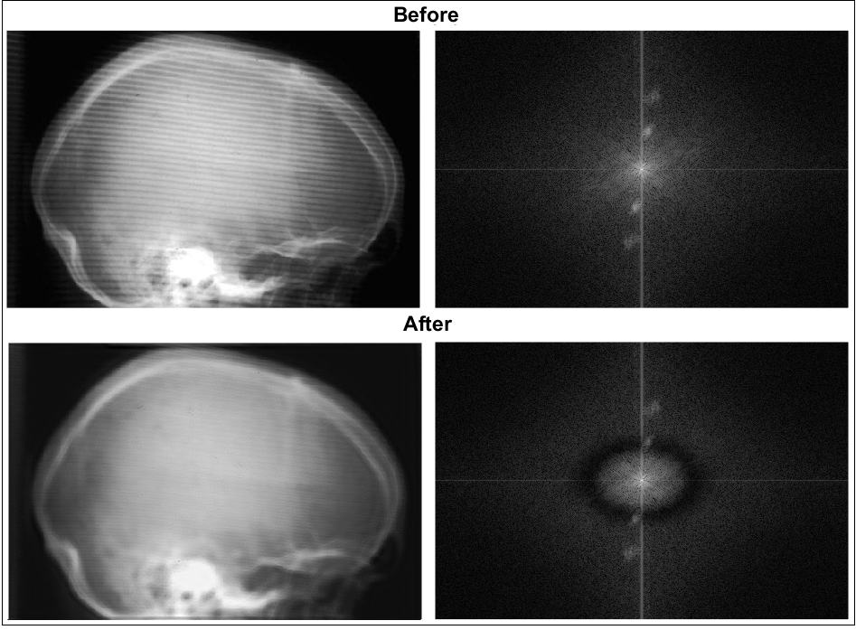

# Digital Image Processing
The answers in MATLAB to a series of educational exercises - assignments, designed to familiarize yourself with both basic and advanced concepts of digital image processing

# Concepts
- 2D Fourier Transform
- Edge Detection
- Image Quantization
- Image Enhancement (noise filtering, histogram equalization, etc)
- Image Restoration
- Filtering in the Frequency Domain

# Examples

