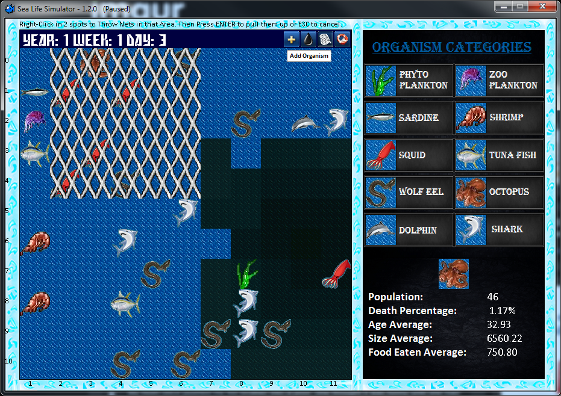

# Sea Life Simulator
Implementation of 2D graphics game, using C++ and SDL

It simulates a simple maritime ecosystem in which:

- Big fish eats small fish
- Pollution can be added
- Throw your nets and see what that gets you
- Watch statistics 

